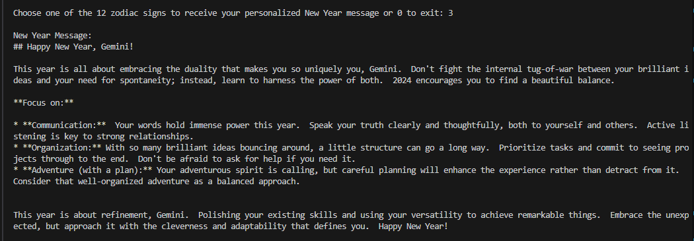

## Data Analysis with Generative AI Model and Python
- Created a program which provides data analysis on the dataset from https://www.kaggle.com/datasets/anthonytherrien/depression-dataset?resource=download
- Using gemini-1.5-flash model, Pandas and Python: Google Gen AI SDK

## User can select any analyze option
  
## Show model results to the user
  
